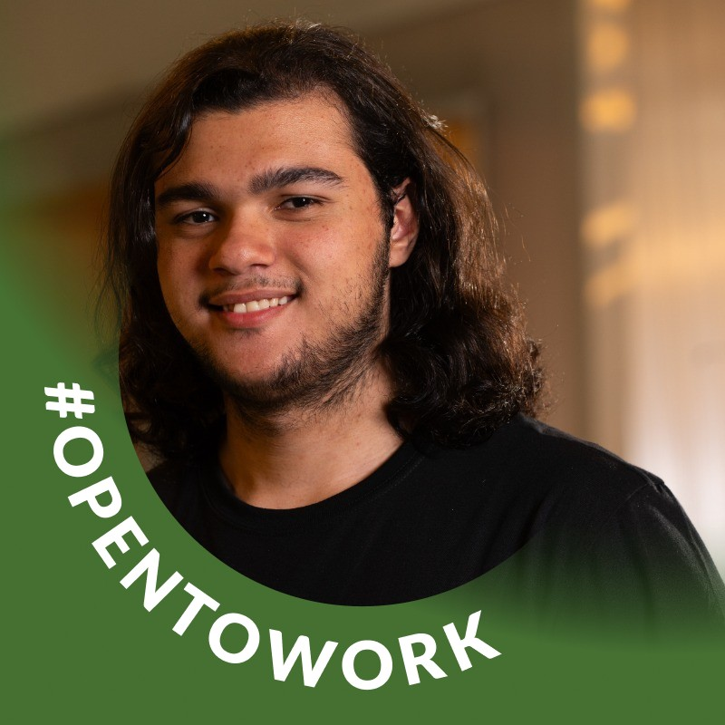

<table>
<tr>
<table>
<tr>
<td>
</td>
</tr>
</table>

# Nome do Projeto: GoTurismo
### Nome do Grupo: G1dev
. Integrantes do grupo…

  <table>
     <tr>
      <td align="center"><a href="https://www.linkedin.com/in/david-deodato-41b9b72b7/"> David Deodato</a></td>
      <td align="center"><a href="https://www.linkedin.com/in/davioliveiraferreira/"> Davi De Oliveira Ferreira</a></td>
       <td align="center"><a href="https://www.linkedin.com/in/raphaelfelipesilva/"> Raphael Silva</a></td>
     <td align="center"><a href="https://www.linkedin.com/in/joão-victor-wandermurem-de-oliveira/"> João Victor Wandermurem</a></td>
      <td align="center"><a href="https://www.linkedin.com/in/igor-sampaio-silva/"> Igor Sampaio</a></td>
      <td align="center"><a href="https://www.linkedin.com/in/ricardo-de-toledo-planas-365b932ba/">
  </table>

## Sumário
[1. Visão Geral do Projeto](#1-visão-geral-do-projeto)
- [1.1 Visão Geral do Projeto](#c1.1)
- [1.2 Tema](#c1.2)
- [1.3 Problema](#c1.3)
  - [1.3.1 Análise do Problema](#c1.3.1)
  - [1.3.2 Entendimento Geral do Problema](#c1.3.2)
  - [1.3.3 Causas e Origem do Problema](#c1.3.3)
  - [1.3.4 Impacto e Consequências do Problema](#c1.3.4)
- [1.4 Análise do Público-Alvo](#c1.4)
- [1.5 Contexto e Cenário Atual](#c1.4)

[2. Análise da Indústria](#c2)
- [2.1 Matriz SWOT](#c2.1)
   - [2.2.1 O que é uma Matriz SWOT](#c2.2.1)
- [2.2 Conclusão](#c2.2)
- [2.3 Proposta de Valor e Value Proposition Canvas](#c2.3) 
  - [2.3.1 Explicação do Template](#c2.3.1)
- [2.4 Descritivo da Solução](#c2.4) 

[3. Análise da Proposta de Solução](#c3)
- [3.1 Funcionalidades Principais](#c3.1)
- [3.2 Público-Alvo e Problema Resolvido](#c3.2)
- [3.3 Diferenciais Competitivos](#c3.3)
- [3.4 Oceano Vermelho - Mercado Atual](#c3.4)
- [3.5 Matriz ERAC (Eliminar, Reduzir, Aumentar, Criar)](#c3.5)
- [3.6 Novo Espaço de Mercado - Oceano Azul](#c3.6)
- [3.7 Matriz de Avaliação de Valor para Aplicativo](#c3.7)
- [3.8 onclusão](#c3.8)

[4. Casos de Uso](#c4)
- [4.1 Introdução](#c4.1)
- [4.2 Casos de Uso Específicos](#c4.2)
- [4.3  Critérios de Aceitação](#c4.3)
- [4.4 Conclusão](#c4.4)

[5. Pesquisa de público](#c5)
- [5.1 Introdução](#c5.1)
- [5.2 Personas](#c5.2)

[6. UX e UI Design](#c5)
- [6.1 Wireframes](#c6.1)
  - [6.1.1 Tela 1: Home (Mapa)](#c6.1.1)
  - [6.1.2 Tela 2: Perfil](#c6.1.1)
  - [6.1.3  Tela 3: Ranking](#c6.1.1)
- [6.2  Conclusão](#c6.2)
- [6.3 Design de Interface - Guia de Estilos](#c6.3)

[7. UX e UI Design](#c7)
- [7.1 Modelo Conceitual](#c7.1)
- [7.2 Modelo Lógico](#c7.2)

[8. Testes de Software](#c8)
- [8.1 Teste Unitário](#c8.1)
- [8.2 Teste de Integração](#c8.2)
- [8.3 Teste de Regressão](#c8.3)
- [8.4 Teste de Usabilidade](#c8.4)
- [8.5 Teste de Funcionalidade](#c8.5)
- [8.6 Teste de API](#c8.6)

[9. Documentação da API](#c9)

[10. Manual do Usuário](#c10)

[11. Referências](#c11)
