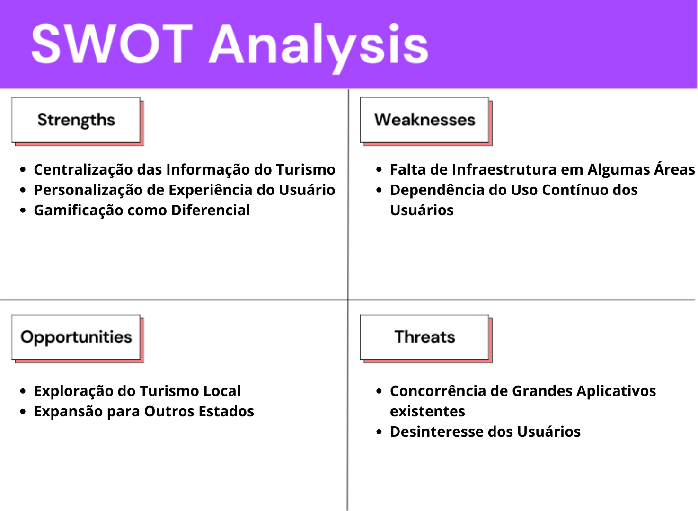
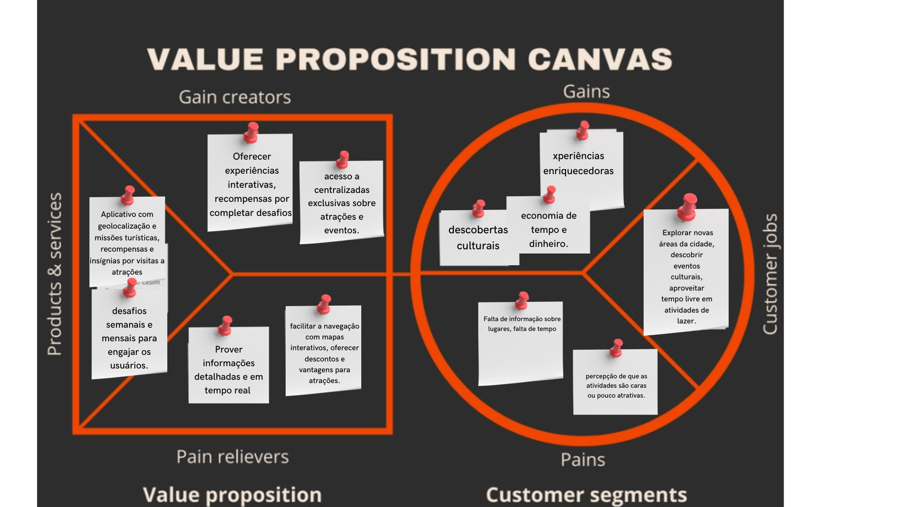

<table>
<tr>
<table>
<tr>
<td>
</td>
</tr>
</table>

# Nome do Projeto: GoTurismo
### Nome do Grupo: G1dev
. Integrantes do grupo…

  <table>
     <tr>
      <td align="center"><a href="https://www.linkedin.com/in/david-deodato-41b9b72b7/"> David Deodato</a></td>
      <td align="center"><a href="https://www.linkedin.com/in/davioliveiraferreira/"> Davi De Oliveira Ferreira</a></td>
       <td align="center"><a href="https://www.linkedin.com/in/raphaelfelipesilva/"> Raphael Silva</a></td>
     <td align="center"><a href="https://www.linkedin.com/in/joão-victor-wandermurem-de-oliveira/"> João Victor Wandermurem</a></td>
      <td align="center"><a href="https://www.linkedin.com/in/igor-sampaio-silva/"> Igor Sampaio</a></td>
      <td align="center"><a href="https://www.linkedin.com/in/ricardo-de-toledo-planas-365b932ba/">
  </table>

## Sumário
[1. Visão Geral do Projeto](#1-visão-geral-do-projeto)
- [1.1 Visão Geral do Projeto](#c1.1)
- [1.2 Tema](#c1.2)
- [1.3 Problema](#c1.3)
  - [1.3.1 Análise do Problema](#c1.3.1)
  - [1.3.2 Entendimento Geral do Problema](#c1.3.2)
  - [1.3.3 Causas e Origem do Problema](#c1.3.3)
  - [1.3.4 Impacto e Consequências do Problema](#c1.3.4)
- [1.4 Análise do Público-Alvo](#c1.4)
- [1.5 Contexto e Cenário Atual](#c1.4)

[2. Análise da Indústria](#c2)
- [2.1 Matriz SWOT](#c2.1)
   - [2.2.1 O que é uma Matriz SWOT](#c2.2.1)
- [2.2 Conclusão](#c2.2)
- [2.3 Proposta de Valor e Value Proposition Canvas](#c2.3) 
  - [2.3.1 Explicação do Template](#c2.3.1)
- [2.4 Descritivo da Solução](#c2.4) 

[3. Análise da Proposta de Solução](#c3)
- [3.1 Funcionalidades Principais](#c3.1)
- [3.2 Público-Alvo e Problema Resolvido](#c3.2)
- [3.3 Diferenciais Competitivos](#c3.3)
- [3.4 Oceano Vermelho - Mercado Atual](#c3.4)
- [3.5 Matriz ERAC (Eliminar, Reduzir, Aumentar, Criar)](#c3.5)
- [3.6 Novo Espaço de Mercado - Oceano Azul](#c3.6)
- [3.7 Matriz de Avaliação de Valor para Aplicativo](#c3.7)
- [3.8 onclusão](#c3.8)

[4. Casos de Uso](#c4)
- [4.1 Introdução](#c4.1)
- [4.2 Casos de Uso Específicos](#c4.2)
- [4.3  Critérios de Aceitação](#c4.3)
- [4.4 Conclusão](#c4.4)

[5. Pesquisa de público](#c5)
- [5.1 Introdução](#c5.1)
- [5.2 Personas](#c5.2)

[6. UX e UI Design](#c5)
- [6.1 Wireframes](#c6.1)
  - [6.1.1 Tela 1: Home (Mapa)](#c6.1.1)
  - [6.1.2 Tela 2: Perfil](#c6.1.1)
  - [6.1.3  Tela 3: Ranking](#c6.1.1)
- [6.2  Conclusão](#c6.2)
- [6.3 Design de Interface - Guia de Estilos](#c6.3)

[7. UX e UI Design](#c7)
- [7.1 Modelo Conceitual](#c7.1)
- [7.2 Modelo Lógico](#c7.2)

[8. Testes de Software](#c8)
- [8.1 Teste Unitário](#c8.1)
- [8.2 Teste de Integração](#c8.2)
- [8.3 Teste de Regressão](#c8.3)
- [8.4 Teste de Usabilidade](#c8.4)
- [8.5 Teste de Funcionalidade](#c8.5)
- [8.6 Teste de API](#c8.6)

[9. Documentação da API](#c9)

[10. Manual do Usuário](#c10)

[11. Referências](#c11)

#  1. Visão Geral do Projeto
	
##  1.1 Organizador do Hackathon
O Hackathon Visite São Paulo é promovido pelo Governo do Estado de São Paulo, uma das maiores e mais influentes administrações públicas do Brasil. Com o objetivo de fomentar o turismo e a inovação, o governo atua em diversas áreas, incluindo o desenvolvimento econômico e social, sendo o estado um dos principais polos de negócios, cultura e turismo do país. São Paulo tem uma ampla infraestrutura, além de ser um centro financeiro e industrial de grande relevância na América Latina, posicionando-se estrategicamente para atrair tanto turistas quanto investimentos. O hackathon visa explorar soluções tecnológicas inovadoras que possam impulsionar o turismo no estado, utilizando dados e recursos disponíveis para criar experiências únicas para os visitantes.

##  1.2 Tema
Como, por meio da tecnologia, podemos transformar os moradores de São Paulo em turistas no próprio destino?

##  1.3 Problema
Descrever o problema ou a oportunidade de negócio.

#  1. Visão Geral do Projeto
	
##  1.1 Organizador do Hackathon
O Hackathon Visite São Paulo é promovido pelo Governo do Estado de São Paulo, uma das maiores e mais influentes administrações públicas do Brasil. Com o objetivo de fomentar o turismo e a inovação, o governo atua em diversas áreas, incluindo o desenvolvimento econômico e social, sendo o estado um dos principais polos de negócios, cultura e turismo do país. São Paulo tem uma ampla infraestrutura, além de ser um centro financeiro e industrial de grande relevância na América Latina, posicionando-se estrategicamente para atrair tanto turistas quanto investimentos. O hackathon visa explorar soluções tecnológicas inovadoras que possam impulsionar o turismo no estado, utilizando dados e recursos disponíveis para criar experiências únicas para os visitantes.

##  1.2 Tema
Como, por meio da tecnologia, podemos transformar os moradores de São Paulo em turistas no próprio destino?

##  1.3 Problema
Descrever o problema ou a oportunidade de negócio.

###  1.3.1 1Análise do Problema
&nbsp;&nbsp;&nbsp;&nbsp;Nesta seção, serão apresentados os problemas identificados e as necessidades do usuário, bem como uma avaliação da situação atual e as possíveis soluções para cada questão. Além disso, serão identificados os obstáculos e limitações do projeto, a fim de assegurar que todas as preocupações sejam abordadas antes do início da implementação. A Análise do Problema é essencial para garantir que a solução do software seja eficaz e atenda às necessidades dos usuários. É importante que seja realizada uma pesquisa exaustiva e que todas as perspectivas sejam consideradas para garantir que a solução seja bem-sucedida.

Nesta seção, analisamos a falta de motivação dos moradores de São Paulo para visitarem as atrações turísticas da própria cidade, identificando suas causas, impactos, e considerando o público-alvo para desenvolver uma solução eficaz e inovadora.

###  1.3.2 Entendimento Geral do Problema

**Qual é o problema central que estamos tentando resolver?**  
O problema central é a falta de motivação dos moradores de São Paulo em visitarem as atrações turísticas da própria cidade. O objetivo é transformar os moradores em "turistas" dentro de São Paulo.

**Quais são os sinais ou sintomas que indicam que esse problema existe?**  
A maioria das pessoas, mesmo residindo em São Paulo, não visita os pontos turísticos disponíveis na cidade.

**Quem são os principais afetados por esse problema? (Usuários, clientes, empresas, comunidades)**  
Os principais afetados são os moradores de São Paulo.

**Qual é a magnitude ou o impacto desse problema para os afetados?**  
O problema afeta a maioria dos moradores da cidade, resultando em baixo engajamento e aproveitamento dos recursos culturais e turísticos locais.

###  1.3.3 Causas e Origem do Problema

**Quais são as possíveis causas que originaram esse problema?**  
- Falta de conhecimento ou interesse nas atrações disponíveis.
- Percepção de que atrações turísticas são voltadas apenas para visitantes de fora.
- Dificuldades logísticas, como trânsito e falta de estacionamento.
- Falta de campanhas ou incentivos que promovam a exploração local.

**Esse problema é recorrente ou isolado?**  
O problema é recorrente, uma vez que é comum em muitas grandes cidades ao redor do mundo, onde os moradores geralmente não se envolvem com atividades turísticas locais.

**Existem fatores externos (econômicos, sociais, tecnológicos) que influenciam a existência do problema?**  
Sim, fatores econômicos como custo de ingressos e transporte, fatores sociais como falta de tempo ou preferência por outras atividades, e fatores tecnológicos como a ausência de uma plataforma integrada que promova e incentive a exploração de pontos turísticos.

**Já houve tentativas anteriores de resolver esse problema? Se sim, por que falharam?**  
Há iniciativas isoladas, como campanhas temporárias de incentivo ao turismo local, mas elas falharam por falta de continuidade e integração com a rotina dos moradores.

###  1.3.4 Impacto e Consequências do Problema

**O que acontece se o problema não for resolvido? Quais são as consequências a curto e longo prazo?**  
- **Curto prazo**: Baixo engajamento com atrações locais, resultando em menos receitas para o setor turístico da cidade.
- **Longo prazo**: Desvalorização do patrimônio cultural e histórico, além da falta de uma identidade turística sólida entre os moradores.

**Como isso afeta a eficiência, a produtividade ou a qualidade de vida dos envolvidos?**  
A falta de engajamento diminui o potencial econômico das atrações turísticas e limita as opções culturais e de lazer dos moradores.

**Quais são os custos ou perdas associadas ao problema (financeiros, sociais, ambientais)?**  
- **Financeiros**: Perda de receitas para o setor turístico local.
- **Sociais**: Desconexão dos moradores com a cultura e a história da cidade.
- **Ambientais**: Potencial subutilização e deterioração de espaços turísticos.

##  1.4 Análise do Público-Alvo

**Quem são os principais usuários ou beneficiários de uma possível solução?**  
Os moradores de São Paulo que poderiam ser incentivados a explorar mais as atrações turísticas locais.

**Quais são suas necessidades e expectativas em relação à solução?**  
Necessidade de conveniência, acessibilidade e incentivos claros para explorar as atrações da cidade de forma prática e envolvente.

**Como eles atualmente lidam com o problema ou tentam mitigar seus efeitos?**  
Atualmente, muitos moradores podem ignorar as atrações turísticas, preferindo atividades mais familiares ou convencionais, como shoppings e cinemas.

##  1.5 Contexto e Cenário Atual

**Qual é o contexto atual em que o problema ocorre? (por exemplo, setor específico, tecnologia disponível)**  
O problema ocorre no contexto urbano de São Paulo, uma cidade com inúmeras atrações culturais, históricas e gastronômicas, mas que sofre com o baixo engajamento dos próprios residentes.

**Existem soluções ou concorrentes no mercado que abordam esse problema? Como eles atuam?**  
Há soluções pontuais como sites e aplicativos de turismo, mas que muitas vezes são voltados apenas para turistas externos, sem um foco específico nos moradores da cidade.

**Há tendências ou inovações que possam influenciar ou agravar o problema?**  
A gamificação surge como uma tendência capaz de transformar o engajamento turístico, tornando as visitas a pontos turísticos mais interativas e incentivando a exploração por meio de recompensas e desafios.

#  2. Análise da Indústria
Análise da indústria (Modelo de 5 Forças de Porter) em relação ao cenário da empresa parceira.

 

##  2.1 Matriz SWOT

###  2.1.1 O que é uma Matriz SWOT?

&nbsp;&nbsp;&nbsp;&nbsp;A matriz SWOT é uma ferramenta estratégica utilizada para identificar e avaliar os **pontos fortes (Strengths)**, **fraquezas (Weaknesses)**, **oportunidades (Opportunities)** e **ameaças (Threats)** relacionadas a um projeto, organização ou produto. Ela auxilia no entendimento completo do ambiente interno e externo, permitindo a criação de estratégias que maximizem o sucesso e minimizem riscos.

Figura 01 - Análise SWOT 
  
Fonte: Material produzido pelos autores (2024)

### Resumo dos Tópicos:

#### **Strengths (Forças)**
- **Centralização das Informações de Turismo**: Nossa solução oferece uma plataforma que reúne diversas informações turísticas de forma acessível e prática, o que facilita o planejamento de atividades pelos usuários.
- **Personalização de Experiência do Usuário**: A plataforma possui um visual amigável e gameficado.
- **Gamificação como Diferencial**: O uso de gamificação proporciona uma experiência lúdica, incentivando o engajamento dos moradores com a cidade de maneira inovadora e divertida.

#### **Weaknesses (Fraquezas)**
- **Falta de Infraestrutura em Algumas Áreas**: Regiões com baixa conectividade ou infraestrutura inadequada podem dificultar a adoção plena da plataforma.
- **Dependência do Uso Contínuo dos Usuários**: O sucesso da solução depende de que os usuários mantenham um uso frequente, sendo necessário fornecer constantemente incentivos para que continuem engajados.

#### **Opportunities (Oportunidades)**
- **Exploração do Turismo Local**: A plataforma pode fomentar o turismo interno, incentivando os próprios moradores a explorar mais sua cidade e assim movimentar o setor.
- **Expansão para Outros Estados**: Com sucesso da plataforma, a solução pode ser escalada para outras regiões do Brasil, ampliando seu impacto e mercado.

#### **Threats (Ameaças)**
- **Concorrência de Grandes Aplicativos Existentes**: Plataformas de turismo já consolidadas, como TripAdvisor e Google Travel, representam uma concorrência significativa.
- **Desinteresse dos Usuários**: Caso os moradores continuem priorizando atividades cotidianas ou não se sintam motivados pelos incentivos, o engajamento com a plataforma pode ser baixo.

###  2.2 Conclusão

&nbsp;&nbsp;&nbsp;&nbsp;A análise SWOT é importante para garantir que todas as variáveis do projeto sejam consideradas, permitindo uma visão ampla sobre o que precisa ser aprimorado e quais oportunidades podem ser exploradas. Ela proporciona uma base sólida para o planejamento estratégico, maximizando o potencial de sucesso ao identificar e mitigar riscos desde o início. Utilizando essa matriz, podemos construir uma solução robusta e bem direcionada para promover o turismo e o engajamento dos moradores de São Paulo.

 

##  2.3 Proposta de Valor e Value Proposition Canvas

A *Proposta de Valor* do projeto visa motivar os moradores de São Paulo a explorarem as atrações turísticas locais, transformando a experiência em algo mais atrativo e interativo através da gamificação. Para desenvolver esta proposta de forma eficaz, utilizamos o *Value Proposition Canvas*, que nos ajuda a alinhar a solução com as necessidades e expectativas do público-alvo.

Figura 02 - Proposta de Valor 
  
Fonte: Material produzido pelos autores (2024)

###  2.3.1 Explicação do Template

1. *Tarefas do Cliente*: Entendemos que o público-alvo busca maneiras de aproveitar melhor o tempo livre, explorando o que a cidade tem a oferecer sem precisar de muito planejamento. A proposta é automatizar e simplificar essa descoberta.

2. *Dores do Cliente*: Identificamos que a falta de informação, a percepção de alto custo e a pouca motivação são barreiras significativas. Por isso, focamos em aliviá-las com uma interface intuitiva e recompensas que incentivam o engajamento.

3. *Ganhos do Cliente*: Nossa solução visa entregar experiências que vão além do básico, criando uma jornada gamificada em que o usuário sente que está ganhando algo em troca ao participar.

4. *Produtos e Serviços*: A plataforma é desenvolvida com foco em praticidade e engajamento, combinando tecnologia de geolocalização e gamificação para tornar a experiência turística mais acessível e atrativa.

5. *Criadores de Ganhos*: As recompensas, insígnias, e a integração com eventos locais são estratégias para valorizar cada interação, gerando um ciclo positivo de engajamento e exploração.

6. *Aliviadores de Dores*: Descontos, mapas interativos e informações atualizadas ajudam a reduzir as barreiras de entrada e tornam o processo de descoberta mais amigável e acessível para o usuário.
---

## Proposta de Solução
&nbsp;&nbsp;&nbsp;&nbsp;O conceito do aplicativo é oferecer uma experiência gamificada semelhante ao Pokémon Go, mas voltada para pontos turísticos. A ideia é que os usuários explorem locais de interesse na cidade, ganhem pontos e insígnias ao visitarem esses pontos, e participem de missões e rankings semanais e mensais. A geolocalização será usada para validar se o usuário está realmente nos pontos turísticos, garantindo que as recompensas sejam liberadas de forma justa. 

&nbsp;&nbsp;&nbsp;&nbsp;Abaixo está uma estrutura organizada da ideia, seguida de um fluxo de telas detalhado para garantir a melhor compreensão e execução do projeto.

## Estrutura e Descrição do Aplicativo

### Mapa Gamificado:
- Ao abrir o aplicativo, o usuário visualiza um mapa interativo, semelhante ao Pokémon Go, com um personagem representando o usuário.
- O personagem se move de acordo com a geolocalização do usuário na vida real.
- No mapa, estarão visíveis os pontos turísticos, representados por ícones relacionados ao tipo de local (exemplo: ícones de museus, parques, monumentos, etc.).

### Missões Semanais e Mensais:
- Cada semana e mês terá um conjunto de missões que consistem em visitar certos pontos turísticos específicos.
- As missões serão iguais para todos os usuários, incentivando competição justa.
- As missões já realizadas serão sinalizadas por um ícone verde de "concluído".

### Sistema de Pontuação:
- As missões concedem pontos ao usuário por visitar novos lugares, eles podem ser acumulados e utilizados para o ranking.
- Se o usuário já tiver visitado o local (com a "insígnia de descoberta"), ele ganhará menos pontos ao completá-lo novamente. Isso incentiva a visitação a novos lugares, ao mesmo tempo em que ainda recompensa os usuários que revisitarem locais para completar as missões.

### Insígnias de Descoberta:
- Cada vez que o usuário visita um novo ponto turístico, ele ganha automaticamente uma "insígnia de descoberta" relacionada ao local.
- Essa insígnia fica visível no perfil do usuário e demonstra que ele já esteve naquele local.
- A insígnia é gerada automaticamente através da geolocalização quando o usuário entra em um raio de proximidade do ponto turístico.

### Coleta de Pontos:
- Ao clicar em um ponto turístico no mapa, um "pop-up" aparecerá com informações sobre o local (história, imagens, curiosidades).
- Na parte inferior do pop-up, haverá um botão de "Coletar Pontos". Esse botão só estará ativado se o usuário estiver dentro de um raio definido (por exemplo, 20 metros) do local.
- Se o usuário não estiver próximo o suficiente, ele ainda poderá visualizar o pop-up, mas não poderá coletar os pontos.

### Rankings:
- *Ranking Semanal*: Similar ao sistema de ranking do Duolingo, será uma competição semanal onde os usuários com mais pontos ganham destaque.
- *Ranking Permanente*: Um ranking global que nunca é resetado, permitindo que usuários que já visitaram muitos pontos turísticos continuem competindo, mesmo ganhando menos pontos por missões repetidas.

### Navegação por Abas:
- O aplicativo terá abas de navegação na parte inferior da tela:
    - *Mapa*: Exibe o mapa interativo com os pontos turísticos e o personagem do usuário.
    - *Missões*: Exibe as missões semanais e mensais com suas respectivas recompensas e status de conclusão.
    - *Perfil*: Exibe as insígnias do usuário, seu progresso e informações de ranking.
- Essas abas garantem fácil navegação entre as funcionalidades principais do aplicativo.

## Fluxo de Telas

1. *Tela Inicial (Splash Screen)*:
   - Exibe o logotipo do aplicativo e uma breve animação de carregamento enquanto a geolocalização do usuário é verificada.

2. *Tela do Mapa*:
   - Exibe o mapa da cidade com pontos turísticos representados por ícones personalizados.
   - O personagem do usuário é mostrado no mapa e se movimenta de acordo com a geolocalização.
   - Ao clicar em um ponto turístico, abre-se um pop-up com detalhes sobre o local.
   - *Botão de Coletar Pontos*: Aparece no pop-up, mas só pode ser clicado se o usuário estiver dentro do raio de proximidade do local (ex: 30 metros).

3. *Tela de Missões*:
   - Exibe as missões semanais e mensais, com a descrição de cada missão e quantos pontos são concedidos ao completá-la.
   - Missões já concluídas são sinalizadas com ícones de "feito" em verde, enquanto as pendentes continuam disponíveis.
   - Missões semanais são resetadas toda semana, enquanto as mensais são resetadas ao final de cada mês.

4. *Tela de Perfil*:
   - Mostra as insígnias de descoberta que o usuário já ganhou ao visitar os pontos turísticos.
   - Exibe também o ranking semanal e o ranking permanente do usuário, destacando sua colocação e pontuação total.

5. *Tela de Ranking*:
   - Exibe o ranking semanal e ranking fixo, permitindo que o usuário veja quem são os líderes.
   - Os usuários podem clicar no perfil dos líderes para ver suas insígnias e progresso no aplicativo.