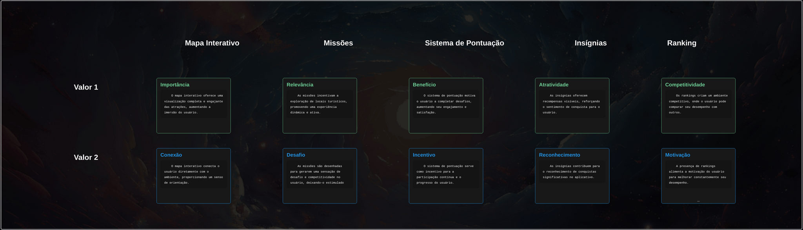
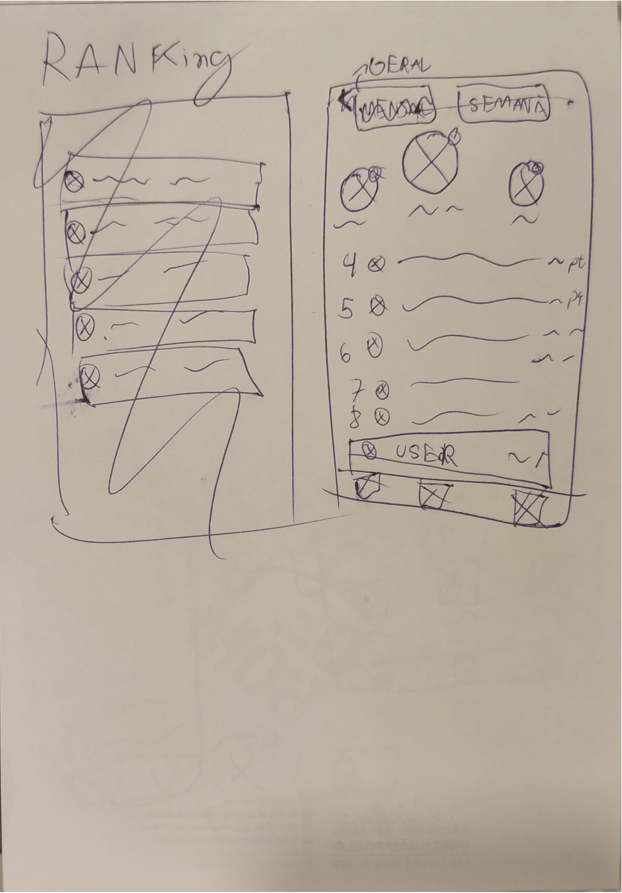

<table>
<tr>
<table>
<tr>
<td>
</td>
</tr>
</table>

# Nome do Projeto: VerdadeiraSP
### Nome do Grupo: G1dev
. Integrantes do grupo…

  <table>
     <tr>
      <td align="center"><a href="https://www.linkedin.com/in/david-deodato-41b9b72b7/"> David Deodato</a></td>
      <td align="center"><a href="https://www.linkedin.com/in/davioliveiraferreira/"> Davi De Oliveira Ferreira</a></td>
       <td align="center"><a href="https://www.linkedin.com/in/raphaelfelipesilva/"> Raphael Silva</a></td>
     <td align="center"><a href="https://www.linkedin.com/in/joão-victor-wandermurem-de-oliveira/"> João Victor Wandermurem</a></td>
      <td align="center"><a href="https://www.linkedin.com/in/igor-sampaio-silva/"> Igor Sampaio</a></td>
      <td align="center"><a href="https://www.linkedin.com/in/ricardo-de-toledo-planas-365b932ba/">
  </table>

## Sumário
[1. Visão Geral do Projeto](#1-visão-geral-do-projeto)
- [1.1 Visão Geral do Projeto](#c1.1)
- [1.2 Tema](#c1.2)
- [1.3 Problema](#c1.3)
  - [1.3.1 Análise do Problema](#c1.3.1)
  - [1.3.2 Entendimento Geral do Problema](#c1.3.2)
  - [1.3.3 Causas e Origem do Problema](#c1.3.3)
  - [1.3.4 Impacto e Consequências do Problema](#c1.3.4)
- [1.4 Análise do Público-Alvo](#c1.4)
- [1.5 Contexto e Cenário Atual](#c1.4)

[2. Análise da Indústria](#c2)
- [2.1 Matriz SWOT](#c2.1)
   - [2.2.1 O que é uma Matriz SWOT](#c2.2.1)
- [2.2 Conclusão](#c2.2)
- [2.3 Proposta de Valor e Value Proposition Canvas](#c2.3) 
  - [2.3.1 Explicação do Template](#c2.3.1)
- [2.4 Descritivo da Solução](#c2.4) 

[3. Análise da Proposta de Solução](#c3)
- [3.1 Funcionalidades Principais](#c3.1)
- [3.2 Público-Alvo e Problema Resolvido](#c3.2)
- [3.3 Diferenciais Competitivos](#c3.3)
- [3.4 Oceano Vermelho - Mercado Atual](#c3.4)
- [3.5 Matriz ERAC (Eliminar, Reduzir, Aumentar, Criar)](#c3.5)
- [3.6 Novo Espaço de Mercado - Oceano Azul](#c3.6)
- [3.7 Matriz de Avaliação de Valor para Aplicativo](#c3.7)
- [3.8 onclusão](#c3.8)

[4. Casos de Uso](#c4)
- [4.1 Introdução](#c4.1)
- [4.2 Casos de Uso Específicos](#c4.2)
- [4.3  Critérios de Aceitação](#c4.3)
- [4.4 Conclusão](#c4.4)

[5. Pesquisa de público](#c5)
- [5.1 Introdução](#c5.1)
- [5.2 Personas](#c5.2)

[6. UX e UI Design](#c5)
- [6.1 Wireframes](#c6.1)
  - [6.1.1 Tela 1: Home (Mapa)](#c6.1.1)
  - [6.1.2 Tela 2: Perfil](#c6.1.1)
  - [6.1.3  Tela 3: Ranking](#c6.1.1)
- [6.2  Conclusão](#c6.2)
- [6.3 Design de Interface - Guia de Estilos](#c6.3)

[7. UX e UI Design](#c7)
- [7.1 Modelo Conceitual](#c7.1)
- [7.2 Modelo Lógico](#c7.2)

[8. Testes de Software](#c8)
- [8.1 Teste Unitário](#c8.1)
- [8.2 Teste de Integração](#c8.2)
- [8.3 Teste de Regressão](#c8.3)
- [8.4 Teste de Usabilidade](#c8.4)
- [8.5 Teste de Funcionalidade](#c8.5)
- [8.6 Teste de API](#c8.6)

[9. Documentação da API](#c9)

[10. Manual do Usuário](#c10)

[11. Referências](#c11)

#  1. Visão Geral do Projeto
	
##  1.1 Organizador do Hackathon
O Hackathon Visite São Paulo é promovido pelo Governo do Estado de São Paulo, uma das maiores e mais influentes administrações públicas do Brasil. Com o objetivo de fomentar o turismo e a inovação, o governo atua em diversas áreas, incluindo o desenvolvimento econômico e social, sendo o estado um dos principais polos de negócios, cultura e turismo do país. São Paulo tem uma ampla infraestrutura, além de ser um centro financeiro e industrial de grande relevância na América Latina, posicionando-se estrategicamente para atrair tanto turistas quanto investimentos. O hackathon visa explorar soluções tecnológicas inovadoras que possam impulsionar o turismo no estado, utilizando dados e recursos disponíveis para criar experiências únicas para os visitantes.

##  1.2 Tema
Como, por meio da tecnologia, podemos transformar os moradores de São Paulo em turistas no próprio destino?

##  1.3 Problema
Descrever o problema ou a oportunidade de negócio.

#  1. Visão Geral do Projeto
	
##  1.1 Organizador do Hackathon
O Hackathon Visite São Paulo é promovido pelo Governo do Estado de São Paulo, uma das maiores e mais influentes administrações públicas do Brasil. Com o objetivo de fomentar o turismo e a inovação, o governo atua em diversas áreas, incluindo o desenvolvimento econômico e social, sendo o estado um dos principais polos de negócios, cultura e turismo do país. São Paulo tem uma ampla infraestrutura, além de ser um centro financeiro e industrial de grande relevância na América Latina, posicionando-se estrategicamente para atrair tanto turistas quanto investimentos. O hackathon visa explorar soluções tecnológicas inovadoras que possam impulsionar o turismo no estado, utilizando dados e recursos disponíveis para criar experiências únicas para os visitantes.

##  1.2 Tema
Como, por meio da tecnologia, podemos transformar os moradores de São Paulo em turistas no próprio destino?

##  1.3 Problema
Descrever o problema ou a oportunidade de negócio.

###  1.3.1 1Análise do Problema
&nbsp;&nbsp;&nbsp;&nbsp;Nesta seção, serão apresentados os problemas identificados e as necessidades do usuário, bem como uma avaliação da situação atual e as possíveis soluções para cada questão. Além disso, serão identificados os obstáculos e limitações do projeto, a fim de assegurar que todas as preocupações sejam abordadas antes do início da implementação. A Análise do Problema é essencial para garantir que a solução do software seja eficaz e atenda às necessidades dos usuários. É importante que seja realizada uma pesquisa exaustiva e que todas as perspectivas sejam consideradas para garantir que a solução seja bem-sucedida.

Nesta seção, analisamos a falta de motivação dos moradores de São Paulo para visitarem as atrações turísticas da própria cidade, identificando suas causas, impactos, e considerando o público-alvo para desenvolver uma solução eficaz e inovadora.

###  1.3.2 Entendimento Geral do Problema

**Qual é o problema central que estamos tentando resolver?**  
O problema central é a falta de motivação dos moradores de São Paulo em visitarem as atrações turísticas da própria cidade. O objetivo é transformar os moradores em "turistas" dentro de São Paulo.

**Quais são os sinais ou sintomas que indicam que esse problema existe?**  
A maioria das pessoas, mesmo residindo em São Paulo, não visita os pontos turísticos disponíveis na cidade.

**Quem são os principais afetados por esse problema? (Usuários, clientes, empresas, comunidades)**  
Os principais afetados são os moradores de São Paulo.

**Qual é a magnitude ou o impacto desse problema para os afetados?**  
O problema afeta a maioria dos moradores da cidade, resultando em baixo engajamento e aproveitamento dos recursos culturais e turísticos locais.

###  1.3.3 Causas e Origem do Problema

**Quais são as possíveis causas que originaram esse problema?**  
- Falta de conhecimento ou interesse nas atrações disponíveis.
- Percepção de que atrações turísticas são voltadas apenas para visitantes de fora.
- Dificuldades logísticas, como trânsito e falta de estacionamento.
- Falta de campanhas ou incentivos que promovam a exploração local.

**Esse problema é recorrente ou isolado?**  
O problema é recorrente, uma vez que é comum em muitas grandes cidades ao redor do mundo, onde os moradores geralmente não se envolvem com atividades turísticas locais.

**Existem fatores externos (econômicos, sociais, tecnológicos) que influenciam a existência do problema?**  
Sim, fatores econômicos como custo de ingressos e transporte, fatores sociais como falta de tempo ou preferência por outras atividades, e fatores tecnológicos como a ausência de uma plataforma integrada que promova e incentive a exploração de pontos turísticos.

**Já houve tentativas anteriores de resolver esse problema? Se sim, por que falharam?**  
Há iniciativas isoladas, como campanhas temporárias de incentivo ao turismo local, mas elas falharam por falta de continuidade e integração com a rotina dos moradores.

###  1.3.4 Impacto e Consequências do Problema

**O que acontece se o problema não for resolvido? Quais são as consequências a curto e longo prazo?**  
- **Curto prazo**: Baixo engajamento com atrações locais, resultando em menos receitas para o setor turístico da cidade.
- **Longo prazo**: Desvalorização do patrimônio cultural e histórico, além da falta de uma identidade turística sólida entre os moradores.

**Como isso afeta a eficiência, a produtividade ou a qualidade de vida dos envolvidos?**  
A falta de engajamento diminui o potencial econômico das atrações turísticas e limita as opções culturais e de lazer dos moradores.

**Quais são os custos ou perdas associadas ao problema (financeiros, sociais, ambientais)?**  
- **Financeiros**: Perda de receitas para o setor turístico local.
- **Sociais**: Desconexão dos moradores com a cultura e a história da cidade.
- **Ambientais**: Potencial subutilização e deterioração de espaços turísticos.

##  1.4 Análise do Público-Alvo

**Quem são os principais usuários ou beneficiários de uma possível solução?**  
Os moradores de São Paulo que poderiam ser incentivados a explorar mais as atrações turísticas locais.

**Quais são suas necessidades e expectativas em relação à solução?**  
Necessidade de conveniência, acessibilidade e incentivos claros para explorar as atrações da cidade de forma prática e envolvente.

**Como eles atualmente lidam com o problema ou tentam mitigar seus efeitos?**  
Atualmente, muitos moradores podem ignorar as atrações turísticas, preferindo atividades mais familiares ou convencionais, como shoppings e cinemas.

##  1.5 Contexto e Cenário Atual

**Qual é o contexto atual em que o problema ocorre? (por exemplo, setor específico, tecnologia disponível)**  
O problema ocorre no contexto urbano de São Paulo, uma cidade com inúmeras atrações culturais, históricas e gastronômicas, mas que sofre com o baixo engajamento dos próprios residentes.

**Existem soluções ou concorrentes no mercado que abordam esse problema? Como eles atuam?**  
Há soluções pontuais como sites e aplicativos de turismo, mas que muitas vezes são voltados apenas para turistas externos, sem um foco específico nos moradores da cidade.

**Há tendências ou inovações que possam influenciar ou agravar o problema?**  
A gamificação surge como uma tendência capaz de transformar o engajamento turístico, tornando as visitas a pontos turísticos mais interativas e incentivando a exploração por meio de recompensas e desafios.

#  2. Análise da Indústria
Análise da indústria (Modelo de 5 Forças de Porter) em relação ao cenário da empresa parceira.

 

##  2.1 Matriz SWOT

###  2.1.1 O que é uma Matriz SWOT?

&nbsp;&nbsp;&nbsp;&nbsp;A matriz SWOT é uma ferramenta estratégica utilizada para identificar e avaliar os **pontos fortes (Strengths)**, **fraquezas (Weaknesses)**, **oportunidades (Opportunities)** e **ameaças (Threats)** relacionadas a um projeto, organização ou produto. Ela auxilia no entendimento completo do ambiente interno e externo, permitindo a criação de estratégias que maximizem o sucesso e minimizem riscos.

Figura 01 - Análise SWOT 
  
Fonte: Material produzido pelos autores (2024)

### Resumo dos Tópicos:

#### **Strengths (Forças)**
- **Centralização das Informações de Turismo**: Nossa solução oferece uma plataforma que reúne diversas informações turísticas de forma acessível e prática, o que facilita o planejamento de atividades pelos usuários.
- **Personalização de Experiência do Usuário**: A plataforma possui um visual amigável e gameficado.
- **Gamificação como Diferencial**: O uso de gamificação proporciona uma experiência lúdica, incentivando o engajamento dos moradores com a cidade de maneira inovadora e divertida.

#### **Weaknesses (Fraquezas)**
- **Falta de Infraestrutura em Algumas Áreas**: Regiões com baixa conectividade ou infraestrutura inadequada podem dificultar a adoção plena da plataforma.
- **Dependência do Uso Contínuo dos Usuários**: O sucesso da solução depende de que os usuários mantenham um uso frequente, sendo necessário fornecer constantemente incentivos para que continuem engajados.

#### **Opportunities (Oportunidades)**
- **Exploração do Turismo Local**: A plataforma pode fomentar o turismo interno, incentivando os próprios moradores a explorar mais sua cidade e assim movimentar o setor.
- **Expansão para Outros Estados**: Com sucesso da plataforma, a solução pode ser escalada para outras regiões do Brasil, ampliando seu impacto e mercado.

#### **Threats (Ameaças)**
- **Concorrência de Grandes Aplicativos Existentes**: Plataformas de turismo já consolidadas, como TripAdvisor e Google Travel, representam uma concorrência significativa.
- **Desinteresse dos Usuários**: Caso os moradores continuem priorizando atividades cotidianas ou não se sintam motivados pelos incentivos, o engajamento com a plataforma pode ser baixo.

###  2.2 Conclusão

&nbsp;&nbsp;&nbsp;&nbsp;A análise SWOT é importante para garantir que todas as variáveis do projeto sejam consideradas, permitindo uma visão ampla sobre o que precisa ser aprimorado e quais oportunidades podem ser exploradas. Ela proporciona uma base sólida para o planejamento estratégico, maximizando o potencial de sucesso ao identificar e mitigar riscos desde o início. Utilizando essa matriz, podemos construir uma solução robusta e bem direcionada para promover o turismo e o engajamento dos moradores de São Paulo.

 

##  2.3 Proposta de Valor e Value Proposition Canvas

A *Proposta de Valor* do projeto visa motivar os moradores de São Paulo a explorarem as atrações turísticas locais, transformando a experiência em algo mais atrativo e interativo através da gamificação. Para desenvolver esta proposta de forma eficaz, utilizamos o *Value Proposition Canvas*, que nos ajuda a alinhar a solução com as necessidades e expectativas do público-alvo.

Figura 02 - Proposta de Valor 
  
Fonte: Material produzido pelos autores (2024)

###  2.3.1 Explicação do Template

1. *Tarefas do Cliente*: Entendemos que o público-alvo busca maneiras de aproveitar melhor o tempo livre, explorando o que a cidade tem a oferecer sem precisar de muito planejamento. A proposta é automatizar e simplificar essa descoberta.

2. *Dores do Cliente*: Identificamos que a falta de informação, a percepção de alto custo e a pouca motivação são barreiras significativas. Por isso, focamos em aliviá-las com uma interface intuitiva e recompensas que incentivam o engajamento.

3. *Ganhos do Cliente*: Nossa solução visa entregar experiências que vão além do básico, criando uma jornada gamificada em que o usuário sente que está ganhando algo em troca ao participar.

4. *Produtos e Serviços*: A plataforma é desenvolvida com foco em praticidade e engajamento, combinando tecnologia de geolocalização e gamificação para tornar a experiência turística mais acessível e atrativa.

5. *Criadores de Ganhos*: As recompensas, insígnias, e a integração com eventos locais são estratégias para valorizar cada interação, gerando um ciclo positivo de engajamento e exploração.

6. *Aliviadores de Dores*: Descontos, mapas interativos e informações atualizadas ajudam a reduzir as barreiras de entrada e tornam o processo de descoberta mais amigável e acessível para o usuário.
---

## Proposta de Solução
&nbsp;&nbsp;&nbsp;&nbsp;O conceito do aplicativo é oferecer uma experiência gamificada semelhante ao Pokémon Go, mas voltada para pontos turísticos. A ideia é que os usuários explorem locais de interesse na cidade, ganhem pontos e insígnias ao visitarem esses pontos, e participem de missões e rankings semanais e mensais. A geolocalização será usada para validar se o usuário está realmente nos pontos turísticos, garantindo que as recompensas sejam liberadas de forma justa. 

&nbsp;&nbsp;&nbsp;&nbsp;Abaixo está uma estrutura organizada da ideia, seguida de um fluxo de telas detalhado para garantir a melhor compreensão e execução do projeto.

## Estrutura e Descrição do Aplicativo

### Mapa Gamificado:
- Ao abrir o aplicativo, o usuário visualiza um mapa interativo, semelhante ao Pokémon Go, com um personagem representando o usuário.
- O personagem se move de acordo com a geolocalização do usuário na vida real.
- No mapa, estarão visíveis os pontos turísticos, representados por ícones relacionados ao tipo de local (exemplo: ícones de museus, parques, monumentos, etc.).

### Missões Semanais e Mensais:
- Cada semana e mês terá um conjunto de missões que consistem em visitar certos pontos turísticos específicos.
- As missões serão iguais para todos os usuários, incentivando competição justa.
- As missões já realizadas serão sinalizadas por um ícone verde de "concluído".

### Sistema de Pontuação:
- As missões concedem pontos ao usuário por visitar novos lugares, eles podem ser acumulados e utilizados para o ranking.
- Se o usuário já tiver visitado o local (com a "insígnia de descoberta"), ele ganhará menos pontos ao completá-lo novamente. Isso incentiva a visitação a novos lugares, ao mesmo tempo em que ainda recompensa os usuários que revisitarem locais para completar as missões.

### Insígnias de Descoberta:
- Cada vez que o usuário visita um novo ponto turístico, ele ganha automaticamente uma "insígnia de descoberta" relacionada ao local.
- Essa insígnia fica visível no perfil do usuário e demonstra que ele já esteve naquele local.
- A insígnia é gerada automaticamente através da geolocalização quando o usuário entra em um raio de proximidade do ponto turístico.

### Coleta de Pontos:
- Ao clicar em um ponto turístico no mapa, um "pop-up" aparecerá com informações sobre o local (história, imagens, curiosidades).
- Na parte inferior do pop-up, haverá um botão de "Coletar Pontos". Esse botão só estará ativado se o usuário estiver dentro de um raio definido (por exemplo, 20 metros) do local.
- Se o usuário não estiver próximo o suficiente, ele ainda poderá visualizar o pop-up, mas não poderá coletar os pontos.

### Rankings:
- *Ranking Semanal*: Similar ao sistema de ranking do Duolingo, será uma competição semanal onde os usuários com mais pontos ganham destaque.
- *Ranking Permanente*: Um ranking global que nunca é resetado, permitindo que usuários que já visitaram muitos pontos turísticos continuem competindo, mesmo ganhando menos pontos por missões repetidas.

### Navegação por Abas:
- O aplicativo terá abas de navegação na parte inferior da tela:
    - *Mapa*: Exibe o mapa interativo com os pontos turísticos e o personagem do usuário.
    - *Missões*: Exibe as missões semanais e mensais com suas respectivas recompensas e status de conclusão.
    - *Perfil*: Exibe as insígnias do usuário, seu progresso e informações de ranking.
- Essas abas garantem fácil navegação entre as funcionalidades principais do aplicativo.

## Fluxo de Telas

1. *Tela Inicial (Splash Screen)*:
   - Exibe o logotipo do aplicativo e uma breve animação de carregamento enquanto a geolocalização do usuário é verificada.

2. *Tela do Mapa*:
   - Exibe o mapa da cidade com pontos turísticos representados por ícones personalizados.
   - O personagem do usuário é mostrado no mapa e se movimenta de acordo com a geolocalização.
   - Ao clicar em um ponto turístico, abre-se um pop-up com detalhes sobre o local.
   - *Botão de Coletar Pontos*: Aparece no pop-up, mas só pode ser clicado se o usuário estiver dentro do raio de proximidade do local (ex: 30 metros).

3. *Tela de Missões*:
   - Exibe as missões semanais e mensais, com a descrição de cada missão e quantos pontos são concedidos ao completá-la.
   - Missões já concluídas são sinalizadas com ícones de "feito" em verde, enquanto as pendentes continuam disponíveis.
   - Missões semanais são resetadas toda semana, enquanto as mensais são resetadas ao final de cada mês.

4. *Tela de Perfil*:
   - Mostra as insígnias de descoberta que o usuário já ganhou ao visitar os pontos turísticos.
   - Exibe também o ranking semanal e o ranking permanente do usuário, destacando sua colocação e pontuação total.

5. *Tela de Ranking*:
   - Exibe o ranking semanal e ranking fixo, permitindo que o usuário veja quem são os líderes.
   - Os usuários podem clicar no perfil dos líderes para ver suas insígnias e progresso no aplicativo.

   #  3. Análise da Proposta de Solução

##  3.1 Funcionalidades Principais
O aplicativo oferece uma experiência gamificada de exploração turística que inclui:
- **Mapa Interativo**: Visualização de pontos turísticos com ícones personalizados, com movimentação do personagem do usuário via geolocalização.
- **Missões Semanais e Mensais**: Conjuntos de missões com pontos acumuláveis, incentivando visitas frequentes.
- **Sistema de Pontuação e Insígnias**: Usuários coletam pontos ao visitar novos locais e ganham insígnias específicas.
- **Rankings Dinâmicos**: Classificação semanal e permanente para estimular a competição saudável.

##  3.2 Público-Alvo e Problema Resolvido
- **Público-Alvo**: Turistas locais, jovens adultos e gamers que buscam experiências interativas e imersivas em ambientes urbanos.
- **Problema Resolvido**: Falta de motivação e interesse para explorar pontos turísticos locais de maneira inovadora e engajante.

##  3.3 Diferenciais Competitivos
- **Geolocalização e Gamificação**: Uso de geolocalização para validação de pontos turísticos e recompensas, oferecendo uma experiência semelhante a jogos de realidade aumentada.
- **Sistema de Missões e Recompensas**: Incentivo contínuo para explorar novos locais através de missões atualizadas e recompensas, mantendo o engajamento do usuário.

##  3.4 Oceano Vermelho - Mercado Atual

### Concorrentes Diretos e Indiretos
1. **Google Maps e Guias de Viagem Tradicionais**:
   - Oferecem recomendações e direções, mas não possuem sistema gamificado ou interativo.
2. **TripAdvisor**:
   - Focado em avaliações e recomendações de turistas, mas não utiliza geolocalização para validar visitas.
3. **Pokémon Go (como referência indireta)**:
   - Utiliza geolocalização e realidade aumentada, mas o foco é no público gamer e não explora aspectos turísticos.

### Comparação de Funcionalidades
- **Interatividade**: Concorrentes tradicionais oferecem conteúdo passivo (textos e imagens), sem envolvimento dinâmico do usuário.
- **Gamificação**: Falta de elementos de gamificação (missões, recompensas) em plataformas de turismo tradicionais.
- **Validação em Tempo Real**: Ausência de validação em tempo real para atividades e missões turísticas, diferentemente da proposta do aplicativo.

##  3.5  Matriz ERAC (Eliminar, Reduzir, Aumentar, Criar)

- **Eliminar**:
  - Dependência de guias físicos e conteúdo passivo, como textos extensivos e vídeos sem interação.
- **Reduzir**:
  - Complexidade de uso, simplificando o onboarding e a navegação entre missões e pontos turísticos.
- **Aumentar**:
  - Intensificar o uso de geolocalização para garantir a precisão na coleta de pontos e a interação em tempo real com o ambiente.
- **Criar**:
  - Sistema de missões gamificadas com recompensas dinâmicas baseadas em conquistas.
  - Ranking e insígnias para cada categoria de ponto turístico, incentivando o usuário a explorar diferentes tipos de locais (museus, parques, monumentos).

##  3.6  Novo Espaço de Mercado - Oceano Azul

### Público-Alvo Inexplorado
- **Jovens adultos e gamers**: Pessoas que normalmente não se interessariam em turismo tradicional, mas que são atraídas por experiências interativas e gamificadas.
- **Turistas locais e moradores da cidade**: Aqueles que buscam redescobrir sua cidade de forma inovadora e lúdica.

### Diferenciais de Valor
- **Exploração Gamificada**: Transformação de pontos turísticos em missões interativas, criando um ambiente de exploração contínua e premiando o usuário por suas descobertas.
- **Integração de Geolocalização e Gamificação**: Combinação única que valida a presença do usuário e cria recompensas personalizadas, diferenciando a experiência de guias tradicionais ou aplicativos de turismo passivo.

### Benefícios Competitivos

- **Experiência Imersiva**: Uso de missões semanais e mensais para incentivar a visitação contínua a novos pontos turísticos, mantendo o engajamento do usuário.
- **Validação em Tempo Real**: Sistema que verifica a presença física do usuário no local, garantindo que as recompensas sejam justas e que as experiências sejam autênticas.
- **Engajamento Contínuo**: Rankings e insígnias que promovem a competição saudável e o senso de conquista entre os usuários, atraindo e retendo tanto turistas quanto jogadores.

##  3.7 Matriz de Avaliação de Valor para Aplicativo

Figura 03 - Matriz de Avaliação de Valor para Aplicativo  
  
Fonte: Material produzido pelos autores (2024)

##  3.8  Conclusão

O aplicativo de turismo gamificado propõe a criação de um novo espaço de mercado ao transformar a exploração de pontos turísticos em uma experiência interativa e imersiva. Ao combinar geolocalização e elementos de gamificação, a solução se diferencia de guias tradicionais e outros aplicativos de turismo que oferecem conteúdo passivo. Dessa forma, o aplicativo não compete diretamente com concorrentes do mercado atual, mas, ao contrário, cria um Oceano Azul ao atingir um público novo, como gamers e turistas locais, oferecendo uma forma inovadora de turismo urbano.

#  4. Casos de Uso

##  4.1 Introdução

A seção de Casos de Uso descreve as funcionalidades do software e como os usuários interagem com ele, apresentando todos os cenários de uso possíveis e detalhando cada interação e resultado esperado. Os casos de uso são fundamentais para garantir que as funcionalidades estejam alinhadas com as necessidades dos usuários e que o software atenda aos requisitos definidos.

Os casos de uso foram organizados utilizando o formato de User Stories, que seguem o seguinte padrão:

> **Como** [PERFIL], **DEVO/POSSO** [AÇÃO] **para** [OBJETIVO]

**Descrição dos Elementos:**
- **PERFIL:** Perfil do usuário que realizará a ação.
- **DEVO/POSSO:** Define se a ação é obrigatória (DEVO) ou opcional (POSSO).
- **AÇÃO:** Descrição da ação que será realizada pelo usuário.
- **OBJETIVO:** Finalidade ou resultado esperado com a ação.

###  4.2 Casos de Uso Específicos

#### Caso de Uso 1: Explorar Pontos Turísticos

- **Como** residente de São Paulo, **posso** visualizar pontos turísticos próximos **para** encontrar opções interessantes para visita.

#### Caso de Uso 2: Coletar Recompensas

- **Como** visitante frequente de atrações turísticas, **devo** completar desafios ou missões **para** coletar recompensas e aumentar meu ranking.

#### Caso de Uso 3: Navegar pelo Mapa

- **Como** usuário do aplicativo, **posso** navegar pelo mapa interativo **para** localizar e acessar detalhes sobre pontos turísticos específicos.

#### Caso de Uso 4: Personalizar Perfil

- **Como** usuário, **posso** personalizar meu perfil **para** registrar meu histórico de visitas e acompanhar meu progresso em missões.

#### Caso de Uso 5: Consultar Ranking

- **Como** residente que participa das missões, **posso** consultar o ranking de usuários **para** saber minha posição e competir com outros usuários.

###  4.3 Critérios de Aceitação

Os critérios de aceitação para cada caso de uso são os padrões que o software deve atender para que seja considerado funcional e esteja em conformidade com os requisitos:

- **Explorar Pontos Turísticos:** O aplicativo deve exibir uma lista de pontos turísticos com base na localização atual do usuário e fornecer informações detalhadas sobre cada ponto.
- **Coletar Recompensas:** O sistema deve registrar as missões concluídas e atualizar o ranking e recompensas do usuário em tempo real.
- **Navegar pelo Mapa:** O mapa deve ser responsivo, permitindo zoom, rotação e visualização detalhada dos pontos turísticos próximos ao usuário.
- **Personalizar Perfil:** O perfil do usuário deve ser editável e refletir corretamente as informações e preferências salvas.
- **Consultar Ranking:** O ranking deve ser atualizado periodicamente e mostrar a classificação de todos os usuários participantes das missões.

###  4.4 Resultados dos Testes de Validação

Os testes foram realizados para verificar se cada funcionalidade atende aos critérios de aceitação estabelecidos. Os resultados de cada caso de uso são apresentados abaixo:

| Caso de Uso              | Total de Testes | Testes Passados | Testes Falhados | Observações                                                                 |
|-------------------------|----------------|-----------------|----------------|------------------------------------------------------------------------------|
| Explorar Pontos Turísticos | 5              | 4               | 1              | Um teste falhou devido a um bug que impede a exibição de detalhes de alguns pontos em certas regiões.  |
| Coletar Recompensas      | 5              | 5               | 0              | Todos os testes passaram com sucesso, e o sistema registrou corretamente as recompensas.               |
| Navegar pelo Mapa        | 6              | 5               | 1              | Um teste apresentou falha ao carregar o mapa em dispositivos com baixa conexão de internet.           |
| Personalizar Perfil      | 4              | 4               | 0              | Todos os testes foram concluídos com sucesso, permitindo edições e salvando preferências corretamente. |
| Consultar Ranking        | 3              | 3               | 0              | O ranking foi atualizado e exibido corretamente em todos os testes realizados.                         |

###  4.5 Conclusão

Os testes indicam que a maioria dos casos de uso do aplicativo está funcional, com a maior parte dos critérios de aceitação sendo atendida. Os problemas identificados foram documentados e serão tratados em atualizações futuras para garantir a estabilidade e funcionalidade completas da aplicação.

###  4.4 Conclusão

Os casos de uso descritos nesta seção garantem que todas as funcionalidades principais do software estejam documentadas e que as interações esperadas dos usuários sejam claras e objetivas. Com base nas User Stories e nos critérios de aceitação, é possível validar o desenvolvimento e garantir que as entregas estejam alinhadas com os objetivos do projeto.

#  5. Pesquisa de público 

##  5.1 Introdução
As personas são representações fictícias de usuários que ajudam a entender melhor o público-alvo do nosso projeto. Elas são construídas com base em dados reais e pesquisas, humanizando os usuários e facilitando decisões centradas no usuário. Criar personas eficazes permite que desenvolvamos soluções que atendam às necessidades reais dos moradores de São Paulo, motivando-os a explorar os pontos turísticos da cidade.

##  5.2 Personas

Figura 04 - Persona 1  
  
Fonte: Material produzido pelos autores (2024)

Figura 05 - Persona 2  
  
Fonte: Material produzido pelos autores (2024)

Figura 06 - Persona 3  
  
Fonte: Material produzido pelos autores (2024)

#  6. UX e UI Design
Aborda o design e a funcionalidade da aplicação ou sistema em questão. Ela fornece informações sobre como o software é projetado para ser fácil de usar e intuitivo para os usuários. Nesta seção, deve ser possível encontrar descrições detalhadas sobre as principais características e recursos da interface do usuário, como botões, menus, ícones e outros elementos que são utilizados para facilitar a interação do usuário com o software. Além disso, são fornecidos exemplos de como as funcionalidades do software são acessadas e usadas pelos usuários, incluindo informações sobre os passos necessários para realizar tarefas específicas. Esta seção também aborda as principais preocupações de UX, como acessibilidade, usabilidade, consistência e simplicidade. São apresentados exemplos de como o software é projetado para atender às necessidades dos usuários com diferentes tipos de habilidades e recursos.
##  6.1 Wireframes

Wireframes são representações básicas e estruturais de uma interface, com o objetivo de organizar e definir os elementos principais de cada tela de uma aplicação. Eles servem para mapear a hierarquia de informações, os componentes e a disposição de cada elemento, sem se preocupar com aspectos visuais como cores e estilos. No contexto do nosso projeto, os wireframes foram desenhados no papel para ilustrar as três telas principais da aplicação: a **Home (Mapa)**, o **Perfil**, e o **Ranking**. Abaixo, detalhamos cada uma dessas telas com base nos elementos estruturais representados nos wireframes.

###  6.1.1 Tela 1: Home (Mapa)

Figura 07 - Wireframe 1  
  
Fonte: Material produzido pelos autores (2024)

A tela principal do aplicativo é um mapa interativo onde o usuário pode visualizar seu avatar e os pontos turísticos disponíveis para visita. Esse conceito se assemelha a jogos de realidade aumentada, como Pokémon GO. Além disso, o usuário tem acesso a missões por meio de um pop-up no canto da tela. Ao clicar, uma sobreposição se abre com os detalhes das missões, incentivando a interação e exploração do usuário.

**Componentes principais:**
- **Mapa interativo:** exibe a localização do usuário e pontos turísticos próximos.
- **Avatar do usuário:** representado no mapa para mostrar seu movimento em tempo real.
- **Pop-up de missões:** botão que, ao ser clicado, abre uma sobreposição com as missões disponíveis.

###  6.1.2 Tela 2: Perfil

Figura 08 - Wireframe 2  
  
Fonte: Material produzido pelos autores (2024)

A tela de perfil é projetada para exibir as informações pessoais do usuário, como foto, nome e as insígnias conquistadas ao longo do uso do aplicativo. O objetivo dessa tela é engajar o usuário ao apresentar seu progresso e conquistas de forma clara e organizada.

**Componentes principais:**
- **Foto do usuário:** imagem de perfil que pode ser personalizada.
- **Nome e detalhes pessoais:** informações básicas do usuário.
- **Insígnias:** coleção visual de conquistas e recompensas acumuladas.

###  6.1.3 Tela 3: Ranking

Figura 09 - Wireframe 3  
  
Fonte: Material produzido pelos autores (2024)

Na tela de ranking, o usuário pode visualizar sua classificação em relação a outros participantes, incentivando a competição saudável e o engajamento contínuo. O ranking é global, e os usuários são ordenados conforme suas pontuações, mostrando quem são os líderes e motivando os demais a explorar mais pontos turísticos.

**Componentes principais:**
- **Lista de usuários e pontuações:** exibe as classificações dos participantes.
- **Classificação global:** ordena os usuários do maior para o menor, destacando as posições com clareza.

###  6.2 Conclusão

Os wireframes apresentados são fundamentais para definir a estrutura e a hierarquia das telas do aplicativo, permitindo que as funcionalidades e interações sejam testadas e refinadas antes de qualquer desenvolvimento visual. Com esses wireframes, buscamos criar uma experiência clara e intuitiva para incentivar os moradores de São Paulo a explorar a cidade, utilizando um sistema gamificado com recompensas e um mapa interativo para maximizar o engajamento do usuário. Esses esboços no papel são essenciais para garantir que todos os componentes necessários estejam presentes e organizados de forma eficiente antes da implementação final.

### Arquitetura BPMN

### Introdução

A **Arquitetura BPMN (Business Process Model and Notation)** é uma metodologia visual que ajuda a descrever o fluxo de processos e interações em um sistema, permitindo uma compreensão clara e precisa de como as ações se interligam. No contexto deste projeto, o BPMN é utilizado para mapear o funcionamento da solução, desde a abertura do aplicativo até as interações do usuário com as diferentes funcionalidades. Esse diagrama tem como objetivo facilitar a visualização dos processos e garantir que todos os elementos do sistema estejam integrados de forma eficiente.

### Template do BPMN

Figura 010 - Arquitetura BPNM  
  
Fonte: Material produzido pelos autores (2024)

### Conclusão

A arquitetura BPMN detalhada para este projeto permite uma visão clara do fluxo de operações, desde o momento em que o usuário abre o aplicativo até as interações específicas, como visualização de pontos turísticos, aceitação de missões, e consulta do ranking. Com esse diagrama, é possível identificar os pontos de decisão e verificar a fluidez do sistema, garantindo que cada ação realizada pelo usuário tenha um resultado definido e contribua para a experiência geral. Essa estrutura visual também ajuda a identificar potenciais melhorias ou otimizações, facilitando o desenvolvimento e o ajuste do sistema ao longo do tempo.

##  6.3 Design de Interface - Guia de Estilos
Refere-se ao design visual, cores, tipografia, imagens, logotipos, ou seja, os elementos visuais que compõem o produto.
Aqu
i você deve colocar o link para seu documento de guia de estilos

#  7. Projeto de Banco de Dados
Documento contendo diagrama de entidades e relacionamentos do banco de dados
##  7.1 Modelo Conceitual
O modelo conceitual deve garantir uma conexão com a realidade. Os 4 tipos de conexões com a realidade são:
conceitos
atributos
identificações
associações
O Modelo Entidade-Relacionamento - MER
entidades e tipos de entidades
atributos e tipos de atributos
relacionamentos e tipos de relacionamentos
##  7.2 Modelo Lógico 
O modelo lógico de banco de dados é uma representação abstrata e simplificada dos dados armazenados no sistema. É utilizado para entender como os dados são relacionados e para garantir a integridade e consistência dos dados armazenados. Incluir  uma descrição detalhada das tabelas, campos e relações presentes no modelo lógico de banco de dados. Também serão apresentadas as regras de negócio e as restrições aplicadas aos dados para garantir a integridade e a consistência dos dados armazenado

#  8. # Manual do Usuário -  VerdadeiraSP

## Índice

1. [Introdução](#introdução)
2. [Requisitos do Sistema](#requisitos-do-sistema)
3. [Instalação](#instalação)
4. [Configurando o Aplicativo](#configurando-o-aplicativo)
5. [Usando o VerdadeiraSP](#usando-o-VerdadeiraSP)
    - [Tela Inicial](#tela-inicial)
    - [Mapeando Rotas e Pontos Turísticos](#mapeando-rotas-e-pontos-turísticos)
    - [Missões e Desafios](#missões-e-desafios)
    - [Sistema de Recompensas](#sistema-de-recompensas)
6. [Personalização de Preferências](#personalização-de-preferências)
7. [Solução de Problemas Comuns](#solução-de-problemas-comuns)

## Introdução

O **VerdadeiraSP** é um aplicativo gamificado desenvolvido para incentivar moradores de São Paulo a explorarem a cidade e seus pontos turísticos de forma interativa e divertida. Este manual tem como objetivo guiar o usuário através do processo de instalação, configuração e utilização das funcionalidades do aplicativo.

## Requisitos do Sistema

Para garantir que o VerdadeiraSP funcione corretamente, verifique se o seu dispositivo atende aos requisitos mínimos abaixo:

- **Sistema Operacional**: Android 8.0 (Oreo) ou superior 
- **Espaço de Armazenamento**: Mínimo de 150 MB disponíveis
- **Conexão de Internet**: Necessária para funcionalidades de geolocalização e interação com servidores
- **Permissões**: Acesso ao GPS, câmera e notificações

## Instalação

1. **Android**: 
   - Acesse o link de download do apk e baixe o "VerdadeiraSP".
   - Clique em "Instalar" e aguarde o download e instalação serem concluídos.

## Configurando o Aplicativo

Após a instalação, siga os passos abaixo para configurar o aplicativo:

1. **Crie uma Conta**: 
   - Ao abrir o aplicativo pela primeira vez, você será solicitado a criar uma conta. Insira seu e-mail, escolha uma senha segura e confirme seu cadastro.
2. **Configuração Inicial**:
   - Conceda permissões de acesso ao GPS para que o aplicativo possa localizar e monitorar sua posição.
   - Ajuste as preferências de notificação e personalize as configurações de privacidade conforme desejado.

## Usando o VerdadeiraSP

### Tela Inicial

Na tela inicial, você encontrará as principais funcionalidades do VerdadeiraSP: 

- **Mapa Interativo**: Mostra sua localização atual e os pontos turísticos próximos que você pode visitar para ganhar recompensas.
- **Menu de Navegação**: Acesse outras seções como Missões, Ranking e Perfil do Usuário.

### Mapeando Rotas e Pontos Turísticos

- Toque no ícone do mapa para visualizar a rota sugerida para os pontos turísticos próximos.
- Utilize o sistema de navegação para guiar seu percurso até o local desejado.

### Missões e Desafios

- Acesse a aba **Missões** para visualizar os desafios diários, semanais e mensais disponíveis.
- Complete os desafios para ganhar badges e pontos que serão acumulados no ranking.

### Sistema de Recompensas

- Ao visitar pontos turísticos, você acumula badges e pontos que podem ser trocados por prêmios ou usados para subir no ranking.
- Pontuações mais altas garantem uma posição de destaque no leaderboard.

## Personalização de Preferências

No menu de configurações, você pode:

- **Ajustar Notificações**: Escolher se deseja receber alertas sobre novos desafios ou pontos turísticos próximos.
- **Configurações de Privacidade**: Controlar quais informações são compartilhadas e com quem.

## Solução de Problemas Comuns

### Problema: O mapa não carrega corretamente.

- **Solução**: Verifique se o GPS está ativado e se você concedeu permissão de localização ao VerdadeiraSP.
- **Dica**: Reinicie o aplicativo e garanta que sua conexão com a internet esteja estável.

### Problema: Não consigo completar uma missão.

- **Solução**: Verifique se você está no local correto e se todos os requisitos da missão foram atendidos.

### Atualizações

Esse manual será atualizado frequentemente para incluir novas funcionalidades e melhorias do aplicativo. Certifique-se de ter a versão mais recente do VerdadeiraSP instalada para aproveitar todos os recursos disponíveis.

 
#  9. Referências

RICHARDS, Greg. Economia Criativa e Turismo Urbano. São Paulo: Editora Cultura Urbana, 2020.

"Local Tourism and Community Identity". Journal of Urban Studies, v. 42, n. 3, p. 215-230, 2021.

LEFEBVRE, Henri. O Direito à Cidade. São Paulo: Editora Paz e Terra, 2001.

"Urban Identity and Belonging in Global Cities". Journal of Urban Identity, v. 35, n. 1, p. 89-105, 2020.

"São Paulo: Territórios de Conflito e Cultura". YouTube, 2018. Disponível em: 

MARQUES, Eduardo. Desigualdade e Mobilidade Urbana. São Paulo: Editora Perspectiva, 2015.

"The Impact of Social Class on Urban Mobility and Access to Leisure". Urban Sociology Review, v. 29, n. 2, p. 135-150, 2021.

HADDAD, Carlos. Políticas Públicas e Turismo Local. São Paulo: Editora Atlas, 2018.

"Local Government's Role in Promoting Urban Tourism". Journal of Public Administration, v. 48, n. 2, p. 178-195, 2021.

SOUZA, Ana Luiza. Turismo Sustentável em Cidades Grandes. São Paulo: Editora Sustentável, 2017.

"Tourism Crowding in Megacities: Managing Over-Tourism". Journal of Sustainable Tourism, v. 54, n. 4, p. 321-340, 2021.
